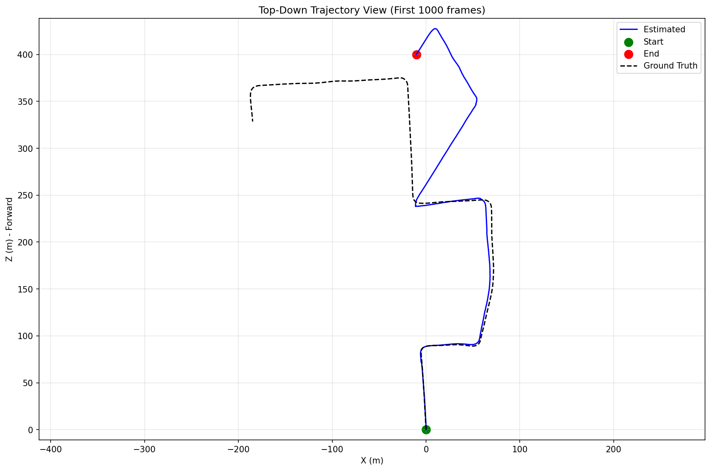
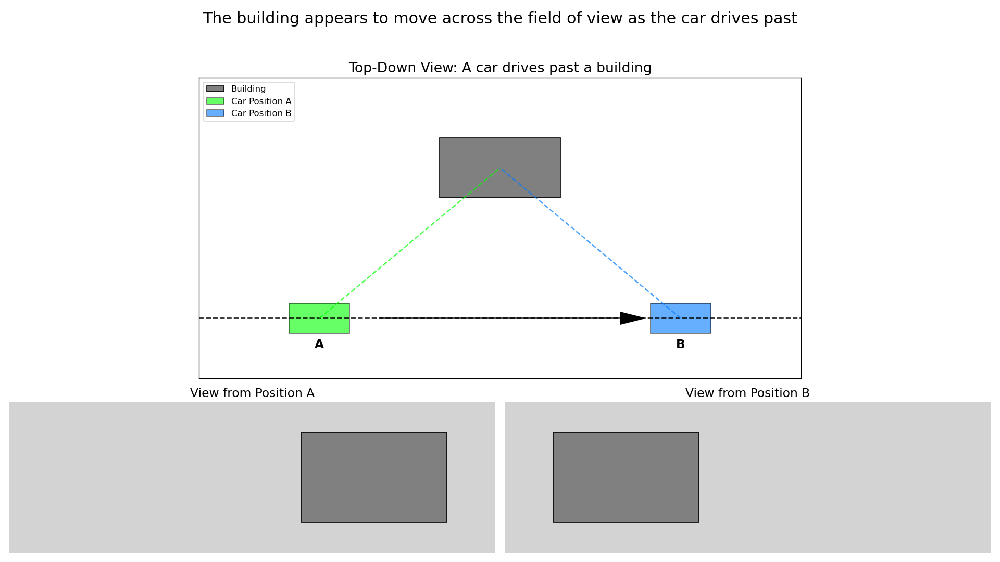
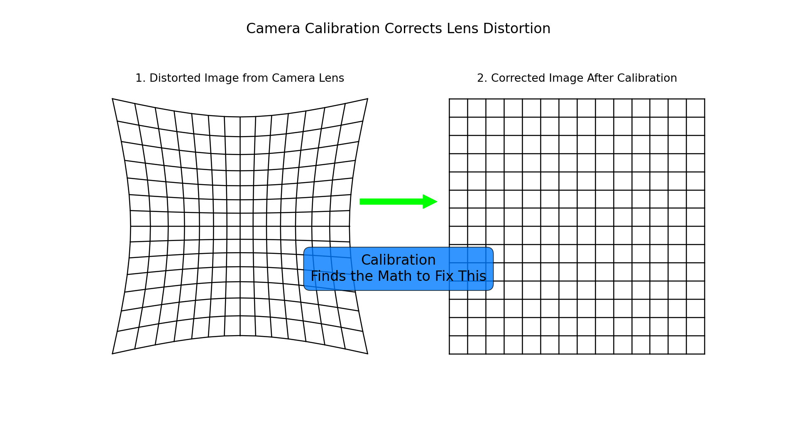
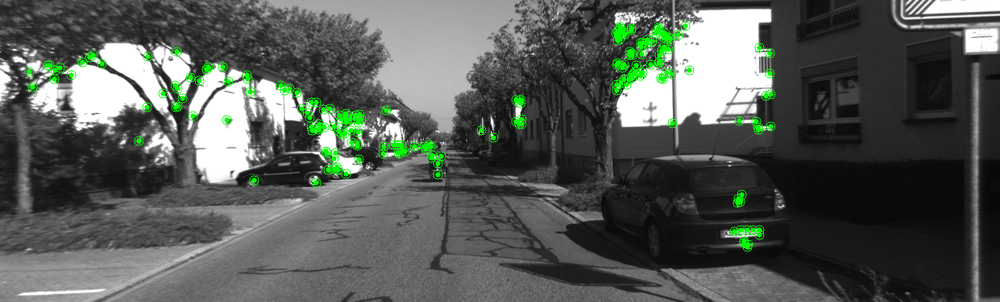
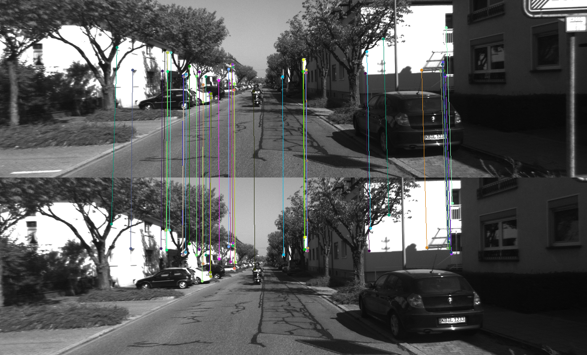
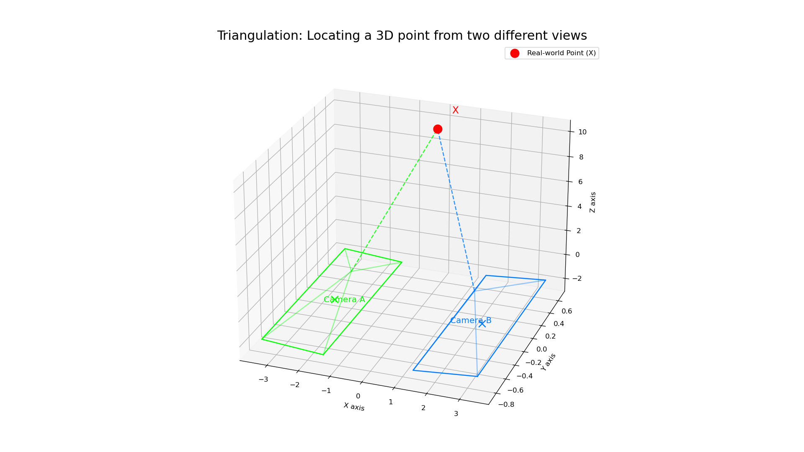
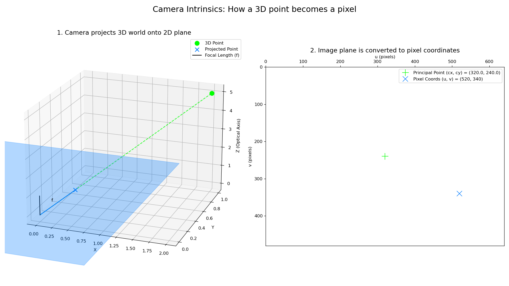

# Chapter 1: Simple Visual Odometry with OpenCV

## Introduction

Imagine a device that needs to navigate but has no GPS—like a robot vacuum in your house or a drone in a warehouse. How can it find its way? One answer is **Visual Odometry**, a technique that lets a device track its own movement using only a camera.

Think of it like a **visual pedometer**: instead of counting footsteps to measure distance, it "counts" visual changes in the world to figure out how far it has moved and in what direction. It builds a path step-by-step, just from what it sees. Because it works by measuring these small, incremental changes, it doesn't know its absolute position (like a latitude/longitude). It only knows where it is relative to where it started.

### From Video to a Path

Here’s how the process works in three steps, turning a stream of images into a map of the journey.

#### 1. Start with the raw camera view
First, the device sees the world through its camera, like this short clip from a car driving down a street:


*Street scenes from the car’s left camera. Notice how buildings, poles, and lane markings slide across the image as the car moves forward.*

#### 2. Find and track visual "landmarks"
The computer doesn't recognize "trees" or "buildings." Instead, it looks for hundreds of small, distinctive points—like sharp corners or unique textures—that it can use as temporary landmarks. It then tracks how these landmarks move from one frame to the next.


*Green dots mark the “landmarks” the algorithm latches onto. As the car moves, these points shift in a predictable way. That motion contains the clue to how the camera moved.*

#### 3. Chain the steps together to build a path
Each tiny, frame-to-frame movement is calculated and added to the previous one. By chaining all these small steps together, the algorithm reconstructs the entire journey from its starting point. The final output is a map of where the camera has been.


*This is the final path for the first ~200 meters of driving, built entirely from the images. The blue line is our estimate, and the red dashed line is the actual path for comparison. The algorithm doesn't know its latitude or longitude; it only knows how far it has moved from where it began.*

As you can see, the estimated path tracks the ground truth remarkably well. However, like any step-counting method, small errors in each measurement can add up over time. This causes the blue line to slowly "drift" away from the red one, which is a natural and expected limitation of this technique.

Over longer distances, this drift becomes more pronounced:


*The full ~800 meter sequence shows how drift accumulates. While the algorithm still captures the general shape of the route, the cumulative errors create a chaotic pattern. This is why real-world systems need loop closure detection or periodic GPS updates to "reset" the drift.*

### A Case Study in Drift: The Altitude Problem
This drift is most dramatic in dimensions where the algorithm has the least confidence. For a car driving on a relatively flat road, there is very little up-and-down motion. This gives the algorithm very few visual cues to measure altitude accurately. As a result, small, random errors in the vertical estimate accumulate rapidly, causing a large, noisy drift in that specific dimension.

The 3D trajectory plot for the first 100 frames illustrates this effect. While the horizontal path (X-Z plane) tracks quite well, the altitude estimate (-Y axis) fails to capture the gentle descent that the ground truth shows. By frame 100, the car has actually descended about 3 meters, but our algorithm thinks it's barely moved vertically at all.


*The 3D view clearly shows the altitude problem. The estimated path (purple) stays nearly flat while the ground truth (red) shows a gentle descent. This happens because the car's minimal up-and-down motion provides very few visual cues for accurate vertical tracking.*

## What Are We Actually Doing?

This technique uses classical computer vision and geometry, not modern AI. Think of it like being a detective—we're looking for clues in the images and using logical reasoning to piece together the story of where the camera moved.

#### What We ARE Doing (The Process)
The core logic follows four simple steps:
1.  **Find distinctive features** in each image (like corners of buildings, unique textures).
2.  **Match these features** between consecutive images.
3.  **Use geometry** to calculate how the camera must have moved to see those features from different angles.
4.  **Chain these movements together** to build a complete path.

This means we are:
- ✅ Using mathematical relationships between images
- ✅ Applying geometric principles (like triangulation)
- ✅ Leveraging known camera properties (calibration)

#### What We're NOT Doing
- ❌ Training neural networks or machine learning models
- ❌ Teaching the computer to "recognize" objects
- ❌ Using any kind of artificial intelligence
- ❌ Determining your real-world location (like GPS latitude/longitude)

#### The Benefit of a Classical Approach
By avoiding complex AI models, this method is lightweight, fast, and doesn't require expensive hardware.
- **No GPUs Needed**: It runs efficiently on standard CPUs.
- **No "Training" Phase**: Unlike machine learning, there's no need for a massive dataset or a lengthy, power-intensive training process. The only setup required is a one-time camera calibration, which is a simple procedure you can do with a printed checkerboard pattern.

This makes it a practical and accessible solution for many real-world applications.

### How GPS (or other anchors) help absolute positioning

Since visual odometry only knows about relative movement, it can't tell you your address. So how is it useful? Its real power comes from filling in the gaps between other, less frequent location sources. Imagine your GPS only updates once every ten seconds. VO can track the detailed twists and turns happening *between* those GPS updates.

If you occasionally get an absolute position (like GPS, AprilTag markers, Wi‑Fi beacons, or a known map feature), you can “re‑anchor” the VO trajectory to correct the drift:
- Use VO between anchors for smooth, high‑rate relative motion.
- When an absolute fix arrives, correct the accumulated offset (relocalize) and continue.
- Over time, this keeps the trajectory aligned without needing constant GPS.

In practice, systems fuse these signals (e.g., with an extended Kalman filter or pose‑graph optimization). VO provides continuous motion updates, while GPS (or similar) provides periodic absolute corrections. The combination yields both smooth short-term motion and long-term global accuracy.

## The "Magic" Behind It

The key insight is that when a camera moves, the same real-world points appear in different locations in the images. By tracking how these points move across images, we can mathematically "reverse engineer" the camera's motion.

**A Simple Analogy**: Imagine you're looking at a building from your car window. As you drive past, the building appears to move across your field of view. If you know the building's real-world location and how it moved in your vision, you can figure out how your car moved. Visual odometry does this with hundreds of points simultaneously.


*This effect, known as parallax, is the key. From position A, the building appears on the right side of the camera's view. From position B, it has shifted to the left. This apparent motion is directly related to the camera's real motion.*

**The Camera Calibration**: Every camera has unique properties, most notably the distortion from its lens, which can make straight lines appear curved. Camera calibration is the process of measuring these properties once, creating a "fingerprint" for that specific camera so we can undo the distortion and work with a perfect image. Think of it like knowing the prescription of someone's glasses—once you know that, you can correct for the visual distortion.


*Calibration finds the mathematical rules to transform the distorted image from the camera into a perfect, corrected one, ensuring our geometric calculations are accurate.*

**Why It Works**: The mathematics of perspective and geometry are universal laws. When we see a square building from an angle, it appears as a trapezoid in the image. The exact shape of that trapezoid tells us precisely what angle we're viewing from. This relationship is completely predictable and reversible.

## Learning Objectives

By the end of this chapter, you will:
- Understand the principles of visual odometry in intuitive terms
- See how geometry and calibration work together to estimate motion
- Implement feature detection and matching
- Estimate camera motion using established mathematical techniques
- Visualize camera trajectories and understand their limitations
- Analyze estimation errors and learn about real-world challenges

## How Visual Odometry Works: Step by Step

Let's walk through the process in plain English before diving into the technical details:

### Step 1: Finding "Landmarks" in Images

Just like you might navigate by remembering distinctive buildings or street signs, our algorithm looks for **distinctive visual features** in each image. These might be:
- Sharp corners of buildings
- Unique textures or patterns  
- High-contrast edges
- Anything that stands out and is easy to spot again

The computer doesn't "understand" what these features are (it doesn't know a corner is part of a building), but it can reliably detect and describe them mathematically.


*A frame from the KITTI dataset - a street scene captured from a car-mounted camera. [Source: KITTI Vision Benchmark Suite](http://www.cvlibs.net/datasets/kitti/)*


*The same frame with 200 detected corner features marked in green. Notice how features cluster around edges, corners, and high-contrast areas.*

**How Does This Work Without Machine Learning?**

Instead of using a convolutional neural network (CNN) that learns to recognize patterns, these classical algorithms follow a set of simple, pre-defined mathematical rules. It's less like "learning" and more like running a tiny, hyper-fast program on thousands of pixels at once.

**Finding Corners (The FAST Method):**
To decide if a pixel is a corner, the CPU performs a simple test:
1.  It looks at a small circle of 16 pixels surrounding a center pixel.
2.  It asks: "Are there at least 9 pixels *in a row* in this circle that are all significantly brighter than the center, or all significantly darker?"
3.  If the answer is yes, it's flagged as a corner.

This is just a series of brightness comparisons—one of the fastest things a CPU can do. It doesn't know it's a "corner of a building"; it just knows that the numbers in the pixel grid pass the test.

**Describing Features (The BRIEF Method):**
Once a corner is found, the algorithm creates a "fingerprint" (called a **descriptor**) for it.
1.  It looks at a small patch of pixels around the corner.
2.  It compares the brightness of a pre-defined set of 256 pairs of pixels within that patch.
3.  For each pair, it records a 1 if the first pixel is brighter, and a 0 otherwise.

This generates a 256-bit binary string (e.g., `10110010...1101`). This fingerprint is highly distinctive for that specific visual feature.

**Why This Is So Fast**:
-   **Simple Math:** The core operations are just comparing numbers (`is pixel A > pixel B?`). There is no complex matrix algebra or calculus.
-   **CPU-Optimized:** These algorithms were designed from the ground up to run efficiently on standard CPUs, without needing a GPU.

**The Key Insight**: Corners, edges, and distinctive patterns can be defined mathematically. We don't need to "learn" what makes a good feature - researchers figured out mathematical properties that work reliably.

### Step 2: Playing "Spot the Difference"

When we have two consecutive images, we play a sophisticated game of "spot the difference." We look for the same landmarks in both images. This is called **feature matching**.


*Two consecutive frames with 50 matched features shown as colored lines. Each color represents a unique feature tracked between frames. Notice how most lines are nearly vertical (small horizontal movement) since the frames are taken just milliseconds apart.*

The challenge is that the same real-world point might look slightly different in each image due to:
- Different viewing angles
- Lighting changes
- Camera movement
- Slight rotation or scaling

**How Do We Match Features Without ML?**

Remember those 256-bit binary "fingerprints" we created for each feature? To find a match for a feature from the first image, the CPU compares its fingerprint to all the fingerprints in the second image.

**The Matching Process (and Why It's Blazing Fast):**
The comparison uses an operation called **Hamming distance**, which simply counts how many bits are different between two binary strings. This is achieved with an **`XOR`** bitwise operation, which is one of the single fastest instructions a modern CPU can execute.

The feature with the lowest Hamming distance (the fewest different bits) is declared the winner. Because this operation is so incredibly cheap, the CPU can compare one feature against thousands of others in a fraction of a millisecond.

**Example**:
```
Feature in Image 1: 10110010...
Feature in Image 2: 10110110...  ← Only 1 bit different!
Feature in Image 2: 01001101...  ← Many bits different, not a match
```

**Why This Works**:
- Binary comparison is extremely fast (computers do this natively)
- Distinctive features have unique patterns unlikely to match by chance
- We only look for matches in nearby regions (the camera didn't teleport!)

**Filtering Bad Matches (RANSAC)**:
Some matches will be wrong (called **outliers**). We use a clever statistical trick called **RANSAC (Random Sample Consensus)**:
1.  It randomly picks a small, random subset of the matches.
2.  It calculates the camera motion that would be implied by just that small group.
3.  It then checks how many *other* matches in the full set are consistent with that same motion.
4.  It repeats this process many times. The motion that gets the most "votes" (i.e., has the largest set of consistent matches, or **inliers**) is declared the correct one.

This is pure logic and statistics - no learning required! Think of it like finding consensus in a group where some people are giving bad information. The outliers are effectively ignored.

### Step 3: Using Geometry to Solve the Puzzle

Here's where the mathematical "magic" happens. Once we know that the same real-world point appears at different locations in two images, we can use **geometric relationships** to figure out how the camera moved.

This is similar to how surveyors have measured land for centuries - by taking measurements from different positions and using **triangulation**. The key insight is that there's only **one possible camera movement** that would cause all the observed feature movements simultaneously.


*By observing the same point (X) from two different camera positions (A and B), we can pinpoint its exact location in 3D space. Each camera gets a 2D view, but combining them reveals the 3D structure.*

### Step 4: Building the Complete Journey

We repeat this process for every pair of consecutive images, building up a chain of movements. Each step tells us "from here, the camera moved this way," and we combine all these steps to reconstruct the complete path.

### The Role of Camera Calibration

Remember our "glasses prescription" analogy? **Camera calibration** gives us the mathematical relationship between:
- **Pixel coordinates** (where something appears in the image)
- **Real-world angles** (what direction the camera was pointing to see that pixel)

This calibration is done once per camera using a checkerboard pattern or similar known geometry. The KITTI dataset provides this calibration data for us - we don't need to measure it ourselves.


*This visual explains the key calibration parameters (intrinsics). A real-world point is first projected onto a 2D plane based on the camera's focal length (f). Then, its position on that plane is converted into the final pixel coordinates (u, v) using the principal point (cx, cy) and pixel scaling factors (fx, fy).*

## Theory Overview: The Mathematical Foundation

Now that we understand the big picture, let's look at the mathematical principles that make it all work:

### Mathematical Foundation

The relationship between 3D points and their 2D projections is governed by the camera projection equation:

$$\mathbf{x} = \mathbf{K}[\mathbf{R}|\mathbf{t}]\mathbf{X}$$

Where:
- $\mathbf{x}$ is the 2D image point in homogeneous coordinates
- $\mathbf{X}$ is the 3D world point in homogeneous coordinates  
- $\mathbf{K}$ is the $3 \times 3$ camera intrinsic matrix
- $[\mathbf{R}|\mathbf{t}]$ is the $3 \times 4$ camera pose matrix (rotation and translation)

The camera intrinsic matrix has the form:

$$\mathbf{K} = \begin{bmatrix} f_x & 0 & c_x \\ 0 & f_y & c_y \\ 0 & 0 & 1 \end{bmatrix}$$

Where **f_x, f_y** are the focal lengths (in pixel units) and **(c_x, c_y)** is the **principal point** (the pixel where the optical axis hits the image).

### Essential Matrix

The **essential matrix** `E` is a key piece of the geometric puzzle. It's a special 3x3 matrix that mathematically connects the positions of matching points in two different images, assuming a calibrated camera. It encodes the relative rotation and translation between the two camera views. The core relationship is expressed by the **epipolar constraint**:

$$\mathbf{x}_2^T \mathbf{E} \mathbf{x}_1 = 0$$

Where `x_1` and `x_2` are corresponding points in normalized image coordinates. The essential matrix can be decomposed to recover the relative camera pose:

$$\mathbf{E} = [\mathbf{t}]_{\times} \mathbf{R}$$

Where `[t]x` is the skew-symmetric matrix of the translation vector `t`. By finding `E` using the matched points, we can then extract the rotation `R` and translation `t` that describe the camera's motion.

## Dataset: KITTI Visual Odometry

### About the KITTI Dataset

The KITTI (Karlsruhe Institute of Technology and Toyota Technological Institute) Visual Odometry dataset is one of the most widely used benchmarks in computer vision and robotics. It was created by recording real driving scenarios in and around Karlsruhe, Germany using a specially equipped vehicle.

**Dataset Characteristics:**
- **Collection Method**: Recorded from a moving vehicle in urban, residential, and highway environments
- **Sensors**: Stereo camera setup (grayscale and color), Velodyne laser scanner, GPS/IMU system
- **Ground Truth**: High-precision GPS/IMU trajectories for evaluation
- **Scenarios**: Various driving conditions including straight roads, turns, intersections, and parking lots
- **Total Distance**: Over 39 km of trajectories across 22 sequences

**Technical Specifications:**
- **Image Resolution**: 1241 × 376 pixels (after rectification)
- **Frame Rate**: 10 Hz
- **Baseline**: 54 cm stereo baseline
- **Calibration**: Factory-calibrated stereo setup with known intrinsic and extrinsic parameters

**Sequence Types:**
- **Training Set (00-10)**: 11 sequences with ground truth poses available
- **Test Set (11-21)**: 11 sequences for evaluation (ground truth withheld for benchmarking)

**Why KITTI for Visual Odometry:**
1. **Real-world Data**: Captures actual driving scenarios with realistic lighting, weather, and motion
2. **Benchmark Standard**: Widely used in research, enabling comparison with state-of-the-art methods  
3. **Ground Truth**: Precise GPS/IMU trajectories allow quantitative evaluation
4. **Challenging Scenarios**: Includes difficult cases like low-texture areas, dynamic objects, and varying illumination
5. **Scale Diversity**: Contains both short sequences (few hundred meters) and long sequences (several kilometers)

We'll use the KITTI Visual Odometry dataset, which provides:
- Stereo camera sequences
- Ground truth trajectories  
- Camera calibration parameters
- Various driving scenarios

## Implementation Steps

### 1. Dataset Setup

The KITTI Visual Odometry dataset is automatically downloaded using our dataset utilities. Here's how to set it up:

**Quick Start:**
```python
from src.datasets import KITTIDatasetFetcher

# Initialize the fetcher (creates data directory if needed)
kitti = KITTIDatasetFetcher(data_dir="data")

# Download sequence 00 (this may take a while on first run)
sequence_path = kitti.download_sequence("00")
print(f"Dataset ready at: {sequence_path}")
```

**What gets downloaded:**
- **Images**: Grayscale camera sequences (left camera)
- **Poses**: Ground truth camera trajectories 
- **Calibration**: Camera intrinsic and extrinsic parameters

**Loading the data:**
```python
# Load calibration parameters
calib = kitti.load_calibration("00")
K = calib['P0'][:, :3]  # Extract 3x3 intrinsic matrix

# Load ground truth poses (4x4 transformation matrices)
gt_poses = kitti.load_poses("00")

# Get image file paths
image_paths = kitti.get_image_paths("00", camera="image_0")
```

**Dataset Structure:**
After download, your data directory will look like:
```
data/
└── kitti/
    └── sequence_00/
        ├── sequences/00/
        │   ├── image_0/        # Left camera images
        │   └── calib.txt       # Calibration parameters
        └── poses/
            └── 00.txt          # Ground truth poses
```

**Available Sequences:**
- Sequences 00-10: Training set with ground truth
- Sequences 11-21: Test set (no ground truth available)
- We recommend starting with sequence 00 (4540 frames, ~2.2GB)

### 2. Feature Pipeline

Extract and match visual features between consecutive frames:

```python
from src.feature_matching import FeatureMatcher
from src.utils import load_image

# Initialize feature matcher
matcher = FeatureMatcher(detector_type='ORB', max_features=1000)

# Load consecutive images
img1 = load_image(image_paths[0], grayscale=True)
img2 = load_image(image_paths[1], grayscale=True)

# Detect and match features
pts1, pts2 = matcher.detect_and_match(img1, img2)
print(f"Found {len(pts1)} feature matches")

# Visualize matches (optional)
matches_img = matcher.visualize_matches(img1, img2, pts1, pts2)
```

### 3. Motion Estimation

Estimate camera pose from feature correspondences:

```python
from src.pose_estimation import PoseEstimator

# Initialize pose estimator with camera intrinsics
pose_estimator = PoseEstimator(K)

# Estimate relative pose using essential matrix
R, t, inlier_mask = pose_estimator.estimate_pose_essential_matrix(pts1, pts2)

print(f"Rotation matrix:\n{R}")
print(f"Translation vector: {t.flatten()}")
print(f"Inliers: {np.sum(inlier_mask)} / {len(pts1)}")
```

### 4. Trajectory Building

Build complete trajectory using visual odometry:

```python
from src.visual_odometry import SimpleVisualOdometry

# Initialize visual odometry system
vo = SimpleVisualOdometry(K, detector_type='ORB', max_features=1000)

# Process image sequence (with ground truth scale)
estimated_poses = vo.process_image_sequence(
    image_paths[:100],  # Process first 100 frames
    ground_truth_poses=gt_poses[:100]  # For scale resolution
)

# Visualize trajectory
from src.utils import plot_trajectory
plot_trajectory(estimated_poses, gt_poses[:len(estimated_poses)], 
                "Visual Odometry Results")

# Analyze errors
from src.utils import compute_trajectory_error
errors = compute_trajectory_error(estimated_poses, gt_poses[:len(estimated_poses)])
print(f"Mean position error: {errors['mean_position_error']:.3f} m")
```


*Top-down view comparing estimated path (blue) vs ground truth (red dashed) for the first 1000 frames. Start is green, end is red.*


*3D view of the same trajectory showing altitude changes (Y-axis inverted, -Y is up).*

## Putting It All Together: Common Challenges

While the basic idea is straightforward, making visual odometry work reliably in the real world involves solving a few interesting puzzles.

### 1. The Scale Problem: How Far Did We Go?
A single camera can tell you the *direction* you moved, but not the *distance*. Imagine seeing a car get smaller in a video—is it a real car driving away, or a toy car being pulled back just a few inches? From a single viewpoint, it's impossible to tell the difference. This is called the **scale ambiguity** problem.

**The Solutions:**
-   **Stereo Cameras (Two Eyes are Better Than One):** The most common solution is to use two cameras side-by-side, like our own eyes. By comparing the slightly different views from each camera, the algorithm can use triangulation to calculate the true distance to objects and, therefore, the true scale of its own movement.
-   **IMU Sensors:** Another method is to fuse the camera data with an **Inertial Measurement Unit (IMU)**. An IMU is the same sensor in your smartphone that detects when you tilt or rotate it. It measures acceleration and rotation, providing a rough sense of scale that can resolve the camera's ambiguity.

### 2. Feature Quality: Finding Good Landmarks
Our algorithm depends on finding and tracking distinctive "landmarks." But what happens when the environment isn't cooperating?
-   **The Challenge:** Blank walls, repetitive patterns (like bricks or carpet), and poor lighting (too dark, too bright, or full of lens flare) make it hard to find reliable features.
-   **The Solution (Smart Algorithms):** This is where clever algorithms come in. Feature detectors like **ORB** are specifically designed to find robust corner-like points that are stable across different viewpoints. To handle incorrect matches, a statistical method called **RANSAC** acts like a voting system. It tests different possible motions and finds the one that is most consistent with the largest group of feature matches, effectively ignoring the outliers that don't fit the pattern.

### 3. Tricky Movements: Geometric Edge Cases
Some movements are inherently difficult for the algorithm to interpret based on visual flow alone.
-   **Spinning in Place:** If you rotate without moving forward or backward, the whole world seems to shift. It's hard to distinguish this from a sideways movement without more information.
-   **Moving Straight at Something:** If you're driving directly towards a distant object, it gets bigger, but it doesn't shift sideways in the frame. This makes estimating distance very difficult.
-   **Moving Too Slowly:** If the movement between frames is smaller than a few pixels, it's hard to distinguish real motion from image noise.

In these cases, the system might pause its updates until the motion becomes clearer.

## Why Visual Odometry Matters
Despite these challenges, visual odometry is a cornerstone of modern robotics and autonomy for several key reasons:
-   **Ubiquity:** Cameras are cheap, lightweight, and already built into countless devices.
-   **Passive Sensing:** Unlike GPS or Lidar, a camera doesn't need to send out a signal. It passively observes the world, making it power-efficient and undetectable.
-   **Rich Information:** Images provide a huge amount of data about the geometry and texture of the environment, which can be used for more than just navigation (like object recognition or scene understanding).
-   **It Works Everywhere:** It can navigate indoors, outdoors, underground, or even on other planets where GPS is not an option.

Understanding these fundamentals is the first step toward building systems that can navigate intelligently and independently through our complex world.

## Practical Implementation

See the accompanying Jupyter notebook (`demo.ipynb`) for the complete implementation with detailed explanations and visualizations.
