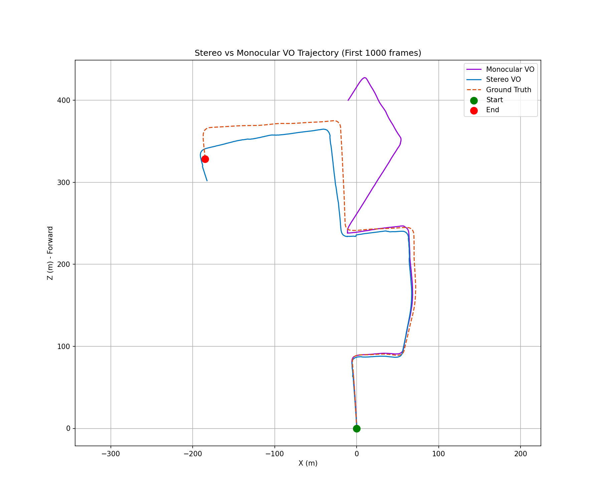
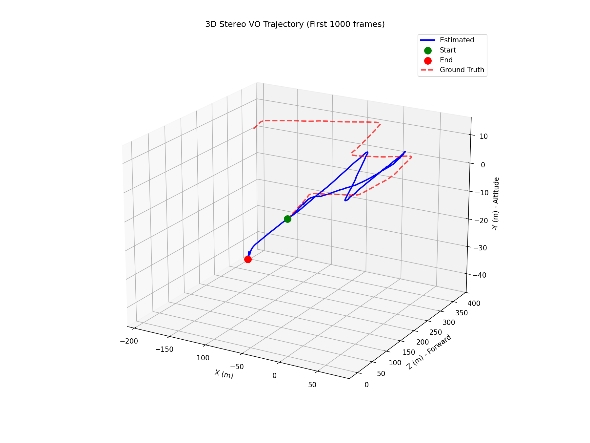

# Chapter 2: Stereo Visual Odometry: Seeing in 3D

## Introduction: The Scale Problem

In Chapter 1, we built a "visual pedometer" that could track a camera's movement by watching the world go by. We successfully reconstructed the *shape* of the path, but it had one fundamental limitation: **we had no idea how big it was.**

A single camera (a **monocular** system) can tell you that you moved forward and turned left, but it can't distinguish between a 1-meter step and a 10-meter leap. This is the **scale ambiguity** problem. To get a correctly scaled path in Chapter 1, we had to "cheat" by using the ground truth data.

So, how do we solve this? We take a hint from our own biology.

### Learning from Human Vision: The Power of Two Eyes

Close one eye and try to touch the tip of your finger to a small object. It's surprisingly difficult. Now, open both eyes. It becomes effortless.

Your brain uses the slightly different perspectives from your two eyes to perceive depth. By comparing how much an object appears to shift between your left and right eye's view, it can instantly calculate how far away that object is. This is called **stereopsis**, and it's the key to solving our scale problem.

In this chapter, we will upgrade our system by adding a second camera, creating a **stereo visual odometry** pipeline that can see the world in 3D and measure its own movement in real-world units.

### Our Goal for This Chapter
By using two cameras with a known, fixed distance between them (the **baseline**), we will:
1.  **Calculate Depth:** Match features between the left and right images to calculate the true 3D distance to points in the world.
2.  **Eliminate Scale Ambiguity:** Recover the camera's motion in meters, creating a trajectory that has a correct, real-world scale.
3.  **Quantify the Improvement:** Directly compare the stereo system against our previous monocular system to prove its superior accuracy.

---

## How Stereo Vision Works: From Two Images to 3D Points

When two cameras are mounted side-by-side, the same real-world point appears at slightly different pixel locations in each image. This difference is called **disparity**, and it's inversely proportional to depth. Nearby objects have a large disparity; faraway objects have a small one.

*The same scene captured by two cameras mounted 54cm apart. Notice how the nearby road markings appear to shift more between images than the distant trees.*

Our algorithm exploits this effect in three steps:

### Step 1: Stereo Matching
First, we find the same distinct feature points in both the left and right images and match them up.

*Lines connect the same real-world point as seen in both cameras. The horizontal shift between matching points is the disparity.*

### Step 2: Calculating the Disparity Map
By doing this for thousands of points, we can create a **disparity map**, which visualizes the depth of the scene. Brighter areas are closer to the cameras (higher disparity), while darker areas are farther away.

*A dense disparity map calculated from the stereo pair. The nearby road and guardrail are clearly visible as brighter objects.*

### Step 3: Triangulation
With the disparity, the camera's focal length, and the baseline (all known from calibration), we can use simple geometry to **triangulate** the precise 3D position (X, Y, Z coordinates in meters) of each matched feature. We now have a 3D point cloud of the world.

---

## The Stereo Visual Odometry Pipeline

Once we can generate 3D points, the rest of the pipeline is surprisingly logical. To calculate the motion from frame `t` to `t+1`, we do the following:

1.  **Get 3D Points at Time `t`**: Perform stereo matching and triangulation on the image pair from time `t` to get a set of 3D world points.
2.  **Find 2D Features at Time `t+1`**: Detect features in the *left* image of the new frame at time `t+1`.
3.  **Match Across Time**: Match the features from the new left image (`t+1`) back to the features of the old left image (`t`).
4.  **Find 3D-to-2D Correspondences**: This match gives us a powerful link: we have a list of points that we know the 3D position of at time `t` and the 2D pixel position of at time `t+1`.
5.  **Solve for Motion with PnP**: Given a set of 3D points and their 2D projections, we can use an algorithm called **Perspective-n-Point (PnP)** to robustly calculate the camera's change in rotation and translation.

Because our 3D points are in real-world meters, the motion we recover is **automatically in the correct scale!**

---

## Results: A Smarter, Scaled Trajectory

The difference is night and day. We ran both the monocular and stereo pipelines on the first 1000 frames of the KITTI dataset.

### Top-Down Trajectory
The stereo VO (blue) produces a path that is correctly scaled from the very first frame. The monocular VO (purple) gets the shape right but is scaled incorrectly and drifts significantly more.

*Top-down view comparing Ground Truth (red dashed), Stereo VO (blue), and Monocular VO (purple). The stereo system achieves correct scale and much higher accuracy.*

### 3D Trajectory
In the 3D view, the stereo system's stability and accuracy are even more apparent. It correctly captures the gentle climb of the vehicle, a detail our monocular system struggled with.

*The stereo trajectory stays much closer to the ground truth, avoiding the large scale errors and drift of the monocular system.*

### Quantitative Improvements
The numbers confirm what our eyes see. The stereo system is not just a little better; it's an order of magnitude more accurate.

*Error over time for both systems. Stereo VO's positional error remains low and stable, while monocular error grows uncontrollably.*

| Metric (1000 frames) | Monocular VO | Stereo VO | Improvement |
| :--- | :--- | :--- | :--- |
| **RMS Position Error** | 89.26 m | **22.54 m** | **74.75%** |
| **Mean Position Error**| 52.43 m | **16.83 m** | **67.90%** |

After driving for roughly 600 meters, the monocular system was off by about 89 meters. The stereo system was off by only 22 meters - a dramatic improvement that comes from being able to perceive depth.

## Conclusion: The Value of a Second Viewpoint

Stereo visual odometry is a powerful technique that solves the fundamental scale ambiguity problem of monocular systems. By adding a second camera, we unlock the ability to perceive depth and measure motion in real-world units, leading to a dramatic improvement in accuracy.

The trade-off is increased complexity and computational cost, but for any application where an accurate, scaled trajectory is needed without relying on external sensors like GPS, stereo vision is an essential tool.

In the next chapter, we will tackle the final major challenge of visual navigation: **long-term drift**. We will introduce the core concepts of **SLAM (Simultaneous Localization and Mapping)** to build a system that can not only track its motion but also recognize previously visited places to create a globally consistent map.
