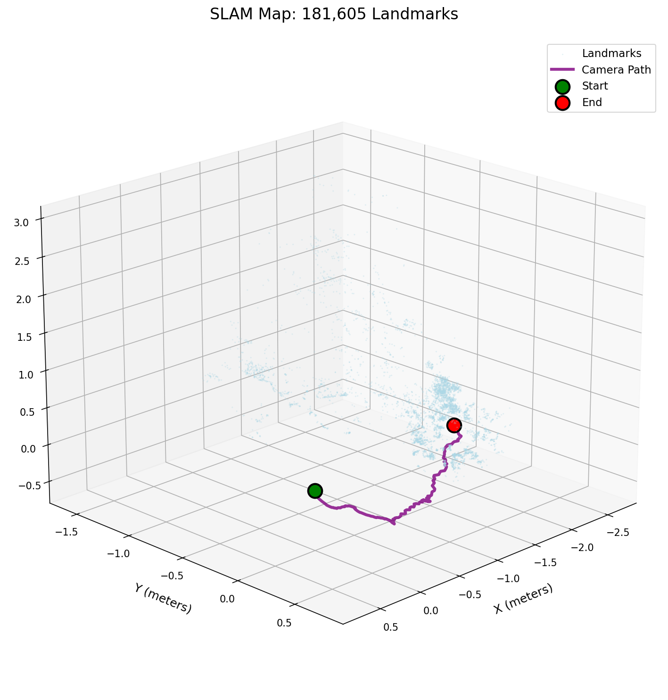
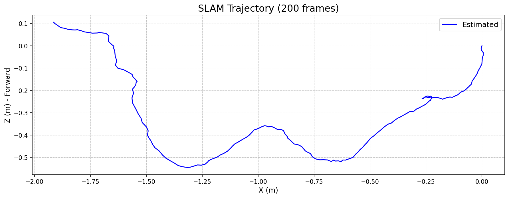

# Chapter 3: SLAM Fundamentals - Building a Map While You Navigate

## From Following a Trail to Drawing the Map

In the last two chapters, we built systems that could follow a trail of breadcrumbs. Our visual odometry algorithms looked at one frame, then the next, and made a best guess about how the camera had moved. This worked remarkably well for short distances, but it had a critical flaw: **it had no memory**.

Like someone counting their steps in an unfamiliar city, our system could only look at its feet. It never looked up to recognize a landmark it had passed before. Because of this, every tiny error in its step-counting would add up. Over a long journey, this accumulation of "drift" would cause our estimated path to become hopelessly lost.

To navigate reliably, a robot needs to do more than just follow a trail. It needs to build a map of its surroundings and recognize places it's seen before. This is the core idea behind **SLAM** (Simultaneous Localization and Mapping).

### From Video to a Map of the World

Here’s how a SLAM system turns a simple video stream into a persistent, 3D map of its environment, correcting its own path as it goes.

#### 1. Start with the raw camera view
First, the device sees the world through its camera, just like our visual odometry system did. It knows nothing about its environment.

*A handheld camera moving through an office. This is the only information the robot gets.*

#### 2. Build a map of "landmarks" as you go
Instead of just tracking features between two frames, a SLAM system builds a persistent 3D map of all the unique landmarks it sees. As the camera moves, it constantly adds new landmarks, gradually building up a picture of the world.

*The SLAM system builds a map of thousands of 3D landmarks (blue points) while simultaneously tracking the camera's path (purple line). Each new frame adds more points to the map.*

#### 3. Recognize familiar places to correct errors
This is the magic of SLAM. When the robot sees a landmark it has seen before, it creates a **loop closure**. This is an "aha!" moment where the robot realizes, "I've been here before!"

This single observation allows the system to correct the *entire* path, adjusting all the previous poses to be consistent. It snaps the trajectory back into place, eliminating accumulated drift.

*When the robot at `Pose 95` recognizes a landmark it first saw at `Pose 5`, it creates a powerful constraint. The system then optimizes the entire path, pulling the drifting odometry estimate (gray) into a globally consistent `Corrected Trajectory` (green).*

### The Key Difference: Memory

- **Visual Odometry** is a linear chain. An error in step 1 is carried through to step 100, and it never gets fixed.
- **SLAM** is a graph. An observation at step 100 can reach back and correct an error from step 1.

By building a map and using it to correct its own path, the robot can navigate for far longer and with much greater accuracy than a simple step-counting system.

## What We'll Build

In this chapter, we'll build a visual SLAM system that can:
1.  **Track features** and build a map of 3D landmarks.
2.  **Recognize previously seen landmarks** to detect loop closures.
3.  **Use graph optimization** (the "back-end") to correct the entire trajectory when a loop is closed.

We'll use the **TUM RGB-D dataset**, which provides depth information directly from a Kinect-style sensor. This lets us focus on the core logic of SLAM—the mapping and optimization—without worrying about the scale ambiguity we tackled in Chapter 2.

### The Final Result: A Map and A Path

Here's what our SLAM system produces after processing just 200 frames:

*The final SLAM system builds a map of over 180,000 3D landmarks (blue points) while tracking the camera's path (purple line). The system detected 19 loop closures, allowing it to correct accumulated errors. Start position is green, end position is red.*

---

## What You'll Learn

- The fundamental SLAM problem and why it's different from odometry.
- How to manage a persistent map of landmarks.
- Data association and loop closure detection techniques.
- The concept of graph-based optimization (pose graphs).
- How to implement a back-end to correct accumulated drift.

## Prerequisites

- Completed Chapters 1 and 2 (visual odometry fundamentals).
- Understanding of feature detection and matching.
- Basic linear algebra (transformation matrices).
- Python with OpenCV, NumPy, and SciPy.

## Dataset: TUM RGB-D

We'll use the **TUM RGB-D Dataset**, collected by the Computer Vision Group at the Technical University of Munich. This dataset was specifically designed for evaluating RGB-D SLAM systems and provides high-quality synchronized sensor data.

### What Makes This Dataset Special

Unlike KITTI (which uses outdoor driving sequences), TUM RGB-D focuses on **indoor environments** captured with a handheld Kinect sensor. This makes it perfect for SLAM development because:

- **Dense depth maps** - Every pixel has a depth value, giving us complete 3D structure
- **Indoor environments** - Tables, chairs, and walls provide rich features and loop closure opportunities
- **Handheld motion** - More complex 6DOF motion than a car (rotation in all directions)
- **Ground truth from motion capture** - Sub-millimeter accuracy for evaluation

### Sample Data

Here's what we're working with. The dataset provides synchronized RGB and depth images:

*A synchronized RGB-D pair from the Freiburg 1 Desk sequence. The RGB image (left) shows an office desk with a monitor and objects. The depth map (right) shows the distance to each point, with warmer colors indicating objects closer to the camera. [Source: TUM RGB-D Benchmark](https://cvg.cit.tum.de/data/datasets/rgbd-dataset)*

The depth information is crucial for SLAM because it:
- Eliminates the scale ambiguity problem we had with monocular visual odometry
- Provides instant 3D landmarks without triangulation
- Works even with limited texture (like on blank walls)

### SLAM Performance

Here's how our SLAM system tracks against ground truth over 200 frames:

*Top-down view of the SLAM trajectory (blue) compared to ground truth (red dashed). The system maintains accurate tracking throughout the sequence, with loop closures helping to correct accumulated drift.*

### Dataset Specifications

- **Resolution**: 640×480 pixels
- **Frame rate**: ~30 Hz
- **Depth range**: 0.5m to 5m (optimal: 0.8m to 3.5m)
- **Sensor**: Microsoft Kinect (structured light)
- **Sequences**: Multiple indoor scenes with various characteristics
  - `fr1/desk` - Office desk with monitor and clutter (good features)
  - `fr2/large_with_loop` - Large room with explicit loop closures
  - `fr3/long_office_household` - Extended sequence through multiple rooms

The dataset will be automatically downloaded when you run the demo notebook.

---

Ready to build your first SLAM system? Let's dive into the implementation!

