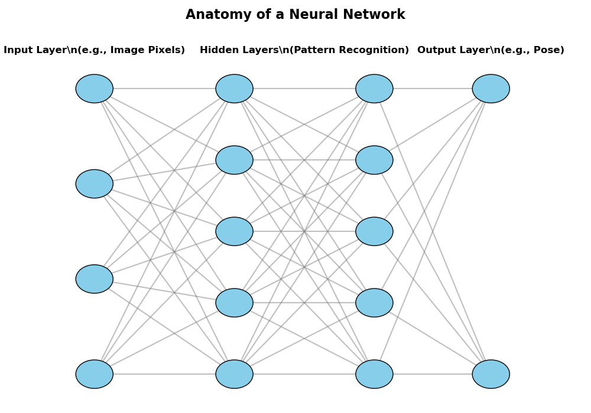
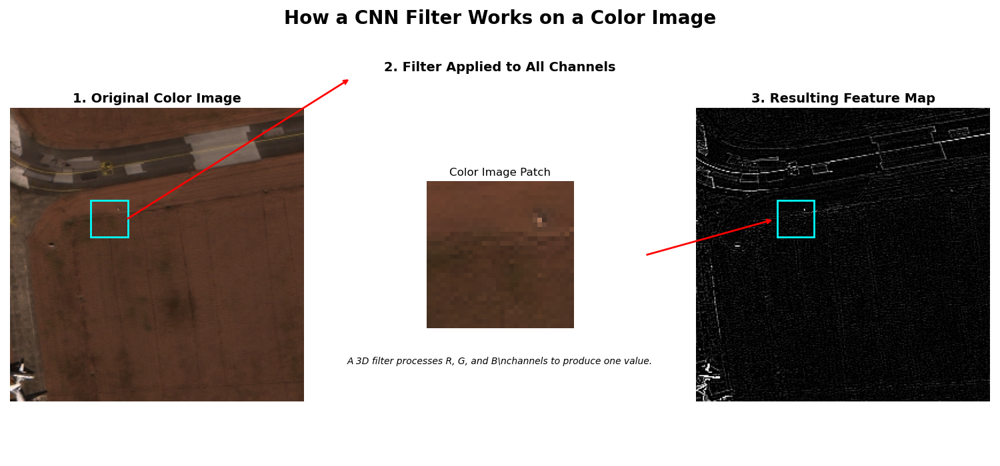
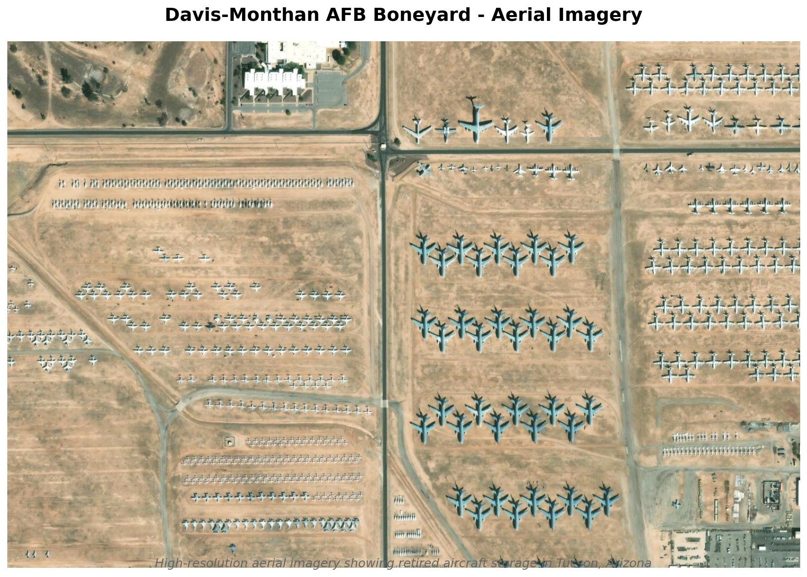
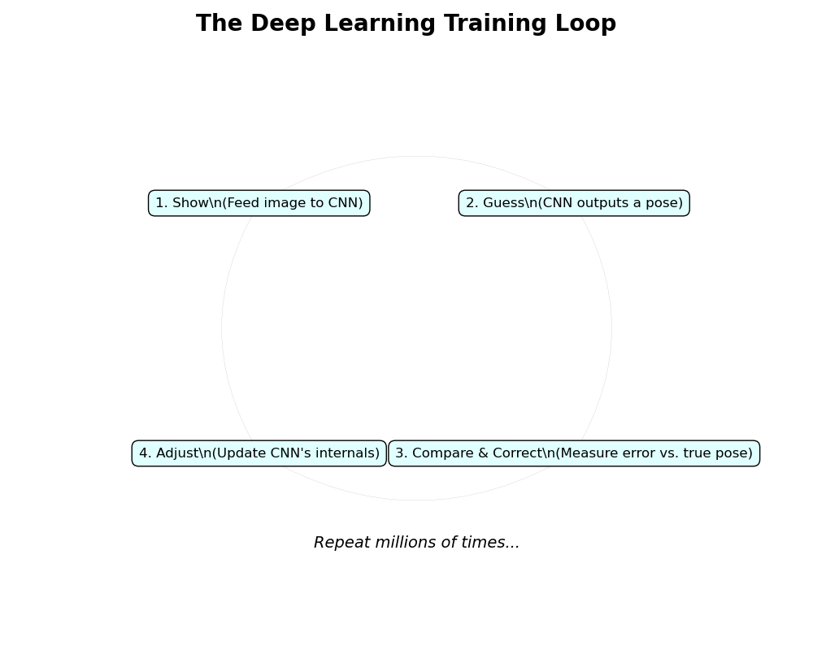

# Chapter 4: Deep Learning for Visual Navigation - A New Kind of Seeing

## From Hand-Crafted Rules to Learning on the Fly

In our journey so far, we've acted like meticulous engineers. We've instructed our algorithms exactly what to do at every step: "find a distinct pixel pattern," "measure how it moves," "calculate the geometry," "estimate the camera's new position." This classical approach, which powers the visual odometry in our first three chapters, is powerful, precise, and a cornerstone of computer vision.

But what happens when the world isn't so clear-cut?

Imagine trying to navigate through dense fog, over a bland, textureless desert, or in lighting so poor that our carefully selected features disappear into the noise. In these scenarios, our hand-crafted rules begin to fail. Our feature detectors can't find anything to lock onto, and our entire geometric pipeline collapses.

*Classical visual odometry excels in clear conditions (top left), but struggles with fog (top right), low light (bottom left), and texture-less environments (bottom right). Deep learning can handle these challenging scenarios more gracefully.*

To solve these harder problems, we need a different approach. Instead of telling the computer *how* to see, what if we could teach it to *learn* how to see?

This is the core idea behind deep learning.

## Meet the Neural Network: A Digital Brain in Miniature

Before we dive into the technicals, let's start with a simple analogy. How does a small child learn to recognize a cat?

You don't give the child a rulebook: "A cat has two triangular ears, whiskers, a long tail, and fur." Instead, you just show them cats. You point and say, "That's a cat." You show them a black cat, a white cat, a sleeping cat, a running cat. Over time, through exposure to hundreds of examples, the child's brain automatically learns the underlying patterns—the "cattiness"—that defines a cat, in all its forms.

A **neural network** works in a remarkably similar way. It's a computational model inspired by the interconnected neurons in our own brains. It's a pattern-finding machine.

You don't give it explicit rules. You give it data—lots and lots of data. You show it an image and tell it what the right answer is. The network makes a guess. At first, its guess is random and completely wrong. But you can measure *how* wrong it is. Using that error, the network slightly adjusts its internal connections, its "neurons," to make a slightly better guess next time.

Repeat this process a million times, and the network slowly tunes itself, learning the intricate patterns that connect the input (the image) to the correct output.

## CNNs: The Vision Specialists

For understanding images, a special type of neural network called a **Convolutional Neural Network (CNN)** is king. While a standard network looks at all the pixels at once, a CNN is more intelligent. It scans an image using a set of virtual "filters," much like a detective sweeping a magnifying glass over a scene.

Each filter is trained to look for a specific low-level feature: one might look for horizontal edges, another for vertical edges, another for a patch of a certain color.

The magic is that the CNN learns the best filters on its own. The first layer of the network might learn to find simple edges and curves. The next layer takes those patterns and learns to combine them into more complex shapes, like corners or circles. The layer after that might combine those shapes to find even more complex objects, like an aircraft wing or a cockpit.

By the end of the network, it has learned a rich, hierarchical representation of the visual world, all on its own, just from the data we showed it.

## A New Mission: Estimating Pose from the Sky

This brings us to our new challenge. We're leaving the streets of Karlsruhe and taking to the skies. For this chapter, we'll be working with aerial imagery of **Davis-Monthan Air Force Base** in Tucson, Arizona—home to the famous "Boneyard," where thousands of retired military aircraft are stored in the desert.

*Aerial imagery of Davis-Monthan Air Force Base in Tucson, Arizona. [Source: ESRI World Imagery](https://www.arcgis.com/home/item.html?id=10df2279f9684e4a9f6a7f08febac2a9), compiled from commercial satellite imagery providers.*

This location is perfect for our purposes: the stark desert landscape provides excellent contrast, the hundreds of parked aircraft give us plenty of visual features, and the continuous aerial imagery allows us to simulate realistic flight navigation.

Our goal is no longer to track a car, but to estimate the **pose** (the 3D position and orientation) of an aircraft from a single satellite image.

This is a perfect task for a CNN. We will design a network that takes an image of an aircraft as input and outputs a series of numbers that define its 3D pose.

How will we train it? The same way the child learns to recognize a cat.
1.  **Show:** We feed the CNN an image of a plane from the dataset.
2.  **Guess:** The network makes a guess at the plane's pose.
3.  **Correct:** We compare its guess to the true, labeled pose from the dataset.
4.  **Adjust:** We calculate the error and use it to adjust the network's internal filters and connections.
5.  **Repeat:** We do this thousands, or even millions, of times.

## The Secret Weapon: A Flight Simulator for our AI

The RarePlanes dataset has a special feature: it includes a vast number of **synthetic** images. These are photorealistic, computer-generated images of aircraft.

[IMAGE: A side-by-side grid showing real aircraft photos from the dataset next to synthetic, computer-generated ones. Highlight how realistic the synthetic ones are.]

Why is this so important? Training a deep learning model requires an enormous amount of data. We can't always get photos of every aircraft type, in every location, at every angle, and in every lighting condition. But with synthetic data, we can! We can generate a virtually infinite variety of training examples, creating a robust "flight simulator" for our AI. This helps the model generalize better when it finally sees real-world images.

## From a Single Glance to a Full Trajectory

By the end of this chapter, we will have a trained model that can estimate an aircraft's pose from a single image. While this is different from the frame-to-frame tracking of our earlier chapters, it's a foundational building block for modern navigation systems.

We can apply this model to a sequence of images to create a full flight path, just like before. But this time, our system will be far more robust to the visual challenges that would have stumped our classical methods.

Now, let's roll up our sleeves, introduce PyTorch to our environment, and teach our machine to see.
