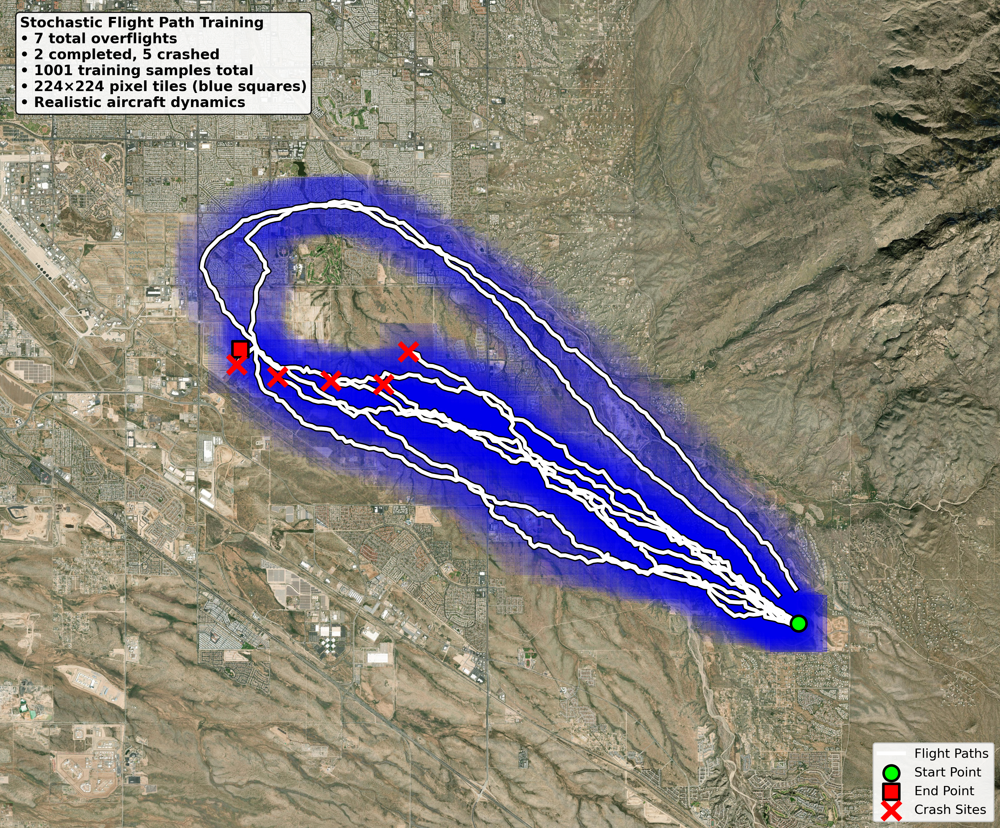
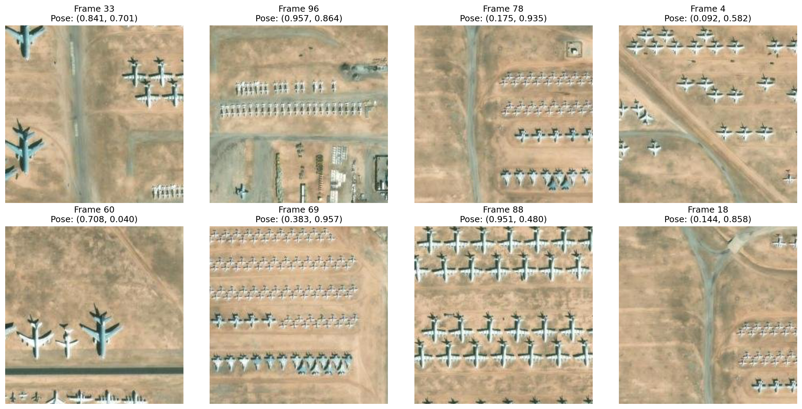
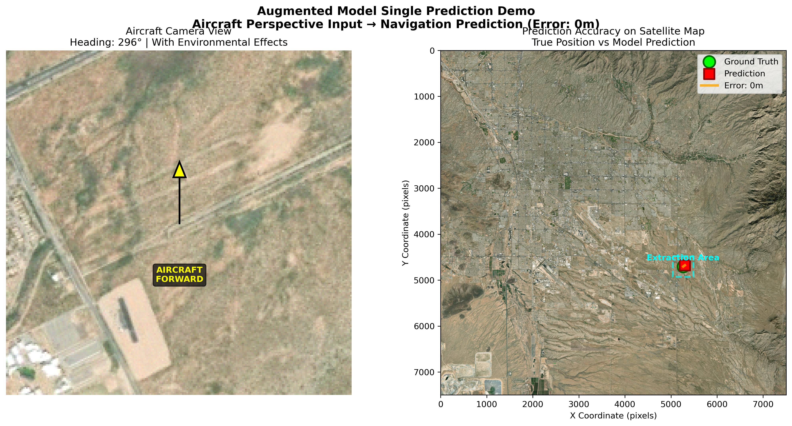
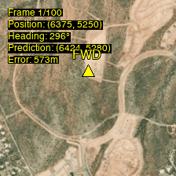
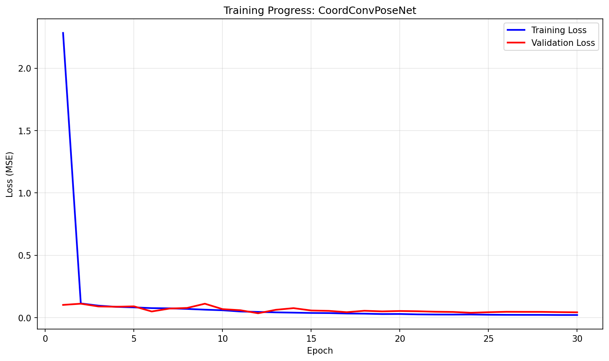

# Chapter 4: Teaching an Aircraft to See

Imagine you are tasked with a critical mission: teaching an aircraft to navigate over a vast, unfamiliar desert to reach a specific destination. The catch? The aircraft's GPS has failed, and it must rely solely on its camera to determine its location. This is the challenge of visual navigation, especially over feature-poor terrain where traditional methods fail.

To solve this, we turn to deep learning. Instead of tracking features between images, we can train a model to recognize terrain patterns from a single image and predict the aircraft's absolute `(x, y)` coordinates on a known map. But to do this, we need data—and not just any data. We need data that reflects the messy reality of real-world missions.

### The Data: Learning from Realistic Flight Conditions

Our model is trained on data from simulated reconnaissance flights. These are not perfect, straight-line paths. They are designed to mimic realistic scenarios where an aircraft flies towards a target, circles the area, and attempts to return. Many of these flights fail, crashing or becoming lost.

This training approach uses stochastic flight paths with crash probabilities concentrated around target areas. Each flight follows start→end→circle→return patterns with about 50% experiencing mission failures at various points. This prevents route memorization and teaches robust navigation patterns across diverse terrain scenarios.

**Realistic Training Conditions:** The training data captures what an aircraft camera actually sees during flight. This includes:

- **Aircraft Perspective Rotation**: Images are rotated based on the aircraft's heading at each point along the flight path. The terrain appears oriented with the aircraft's forward direction as "up" in the image.
- **Variable Altitude**: Random scale variations simulate altitude changes from 500m to 2000m, teaching scale-invariant terrain recognition.
- **Environmental Effects**: Atmospheric haze, lighting variations, sensor noise, and other real-world distortions are applied to simulate actual mission conditions.

By simulating many flights under these realistic conditions, we generate a rich and diverse collection of about 1,000 images, each with a known `(x, y)` coordinate.

### How It Works: A Single Prediction

Once the model is trained, it can predict the aircraft's location from a single frame. The process is simple: the model receives an image of the terrain below, and outputs a coordinate.

First, the model receives a 224x224 pixel image of the terrain directly below the aircraft. It's important to note that the model *only* sees the raw terrain—there are no crosshairs, position indicators, or other clues.

The model then processes this image through its layers. Our navigation architecture is built on **DenseNet121**, a proven computer vision model that we have customized for terrain navigation.

Finally, the model outputs a predicted `(x, y)` coordinate. We can then compare this prediction to the aircraft's true location (ground truth) to measure the error. The visualization below shows this entire process: the raw input on the left, and the resulting prediction and error on the map on the right.

### Putting It to the Test: Navigating a Full Flight Path

By stitching these individual predictions together, the system can track the aircraft's location over an entire flight. We evaluated the system on a standard flight path, testing how well it generalizes from the diverse crash-based training scenarios.

The animation below shows exactly what the model sees during evaluation—20 frames captured along the flight path with the aircraft perspective rotation and environmental effects applied:

Each frame includes the aircraft's heading, position, prediction, and error. The yellow arrow shows the aircraft's forward direction (always pointing "up" in the camera view), demonstrating how the terrain orientation changes as the aircraft follows its flight path.

The visualization below shows the model's performance across the entire simulated flight path. Green circles represent the ground truth flight positions, while red X markers show the model's predictions. Gray lines connect actual vs predicted positions to visualize navigation accuracy.

The results demonstrate robust GPS-poor navigation capability. Despite being trained on challenging failure scenarios rather than memorized routes, the system achieves **559 meters mean error** on the evaluation flight path, demonstrating practical navigation performance under realistic mission conditions.

**Uncertainty Estimation:** The model also predicts its own confidence for each position estimate. The visualization below shows the same flight path with blue circles representing the model's uncertainty bounds (1 standard deviation). Larger circles indicate lower confidence, while smaller circles show where the model is more certain of its prediction.

The model demonstrates reasonable calibration with 70% of predictions falling within their uncertainty bounds (close to the expected 68%). However, the uncertainties tend to be conservative—the model predicts higher uncertainty than the actual errors warrant, which is preferable for safety-critical navigation where underestimating uncertainty could be dangerous.

### Behind the Scenes: A Reproducible Framework

A core goal of this work is not just to solve the problem, but to build a robust and reusable framework for conducting machine learning experiments. The overall process follows a standard machine learning pipeline: we generate data from the map, train a model, evaluate its performance, and visualize the results.

The training process minimizes the error between the model's predicted coordinates and the true coordinates of the training samples. The loss curves below show how the model's error decreased as it learned from the training data over many epochs.

This framework includes modular components for every step of the process, ensuring that all of our results, from single predictions to full flight animations, can be reproduced with simple commands.

### Summary and Next Steps

This work demonstrates that a deep learning-based terrain recognition system can achieve navigation-grade precision for visual localization in GPS-poor environments. By training on realistic flight conditions with proper aircraft perspective, variable altitude, and environmental effects, the model learns robust terrain recognition that works in actual mission scenarios.

**Next Steps:**
- Deploy on embedded hardware for real-world testing
- Extend to larger geographical areas and different terrain types
- Integrate with inertial navigation systems for enhanced robustness
- Optimize for real-time processing requirements
