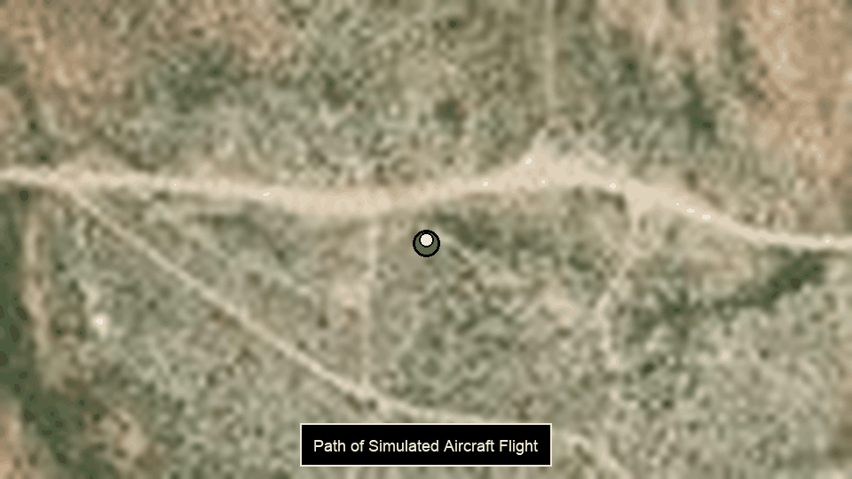
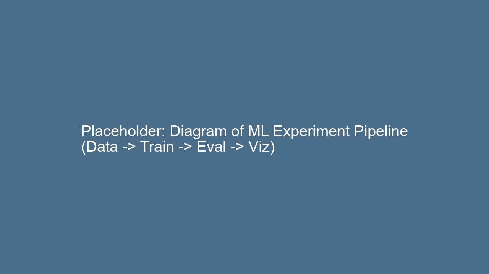
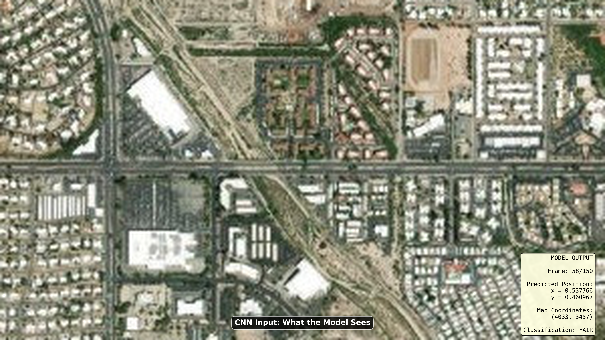
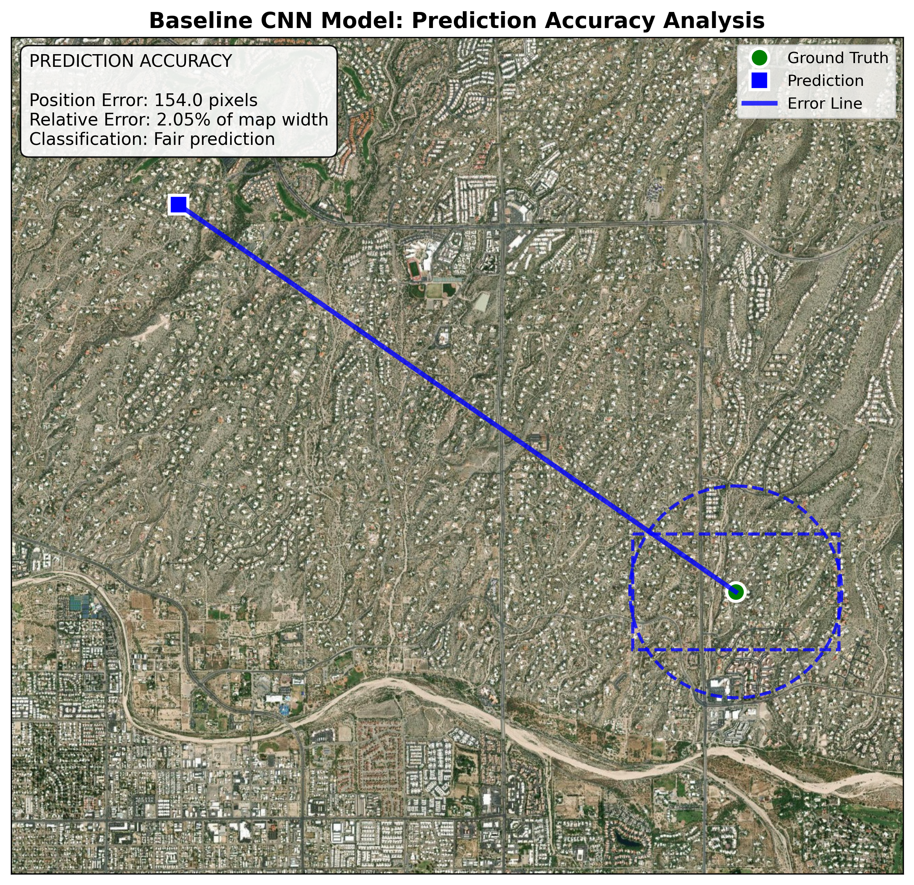
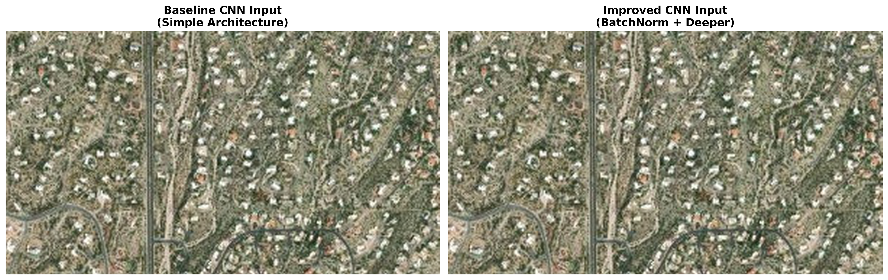
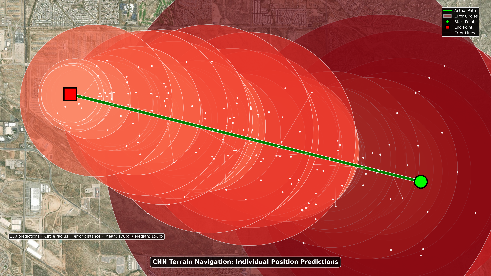
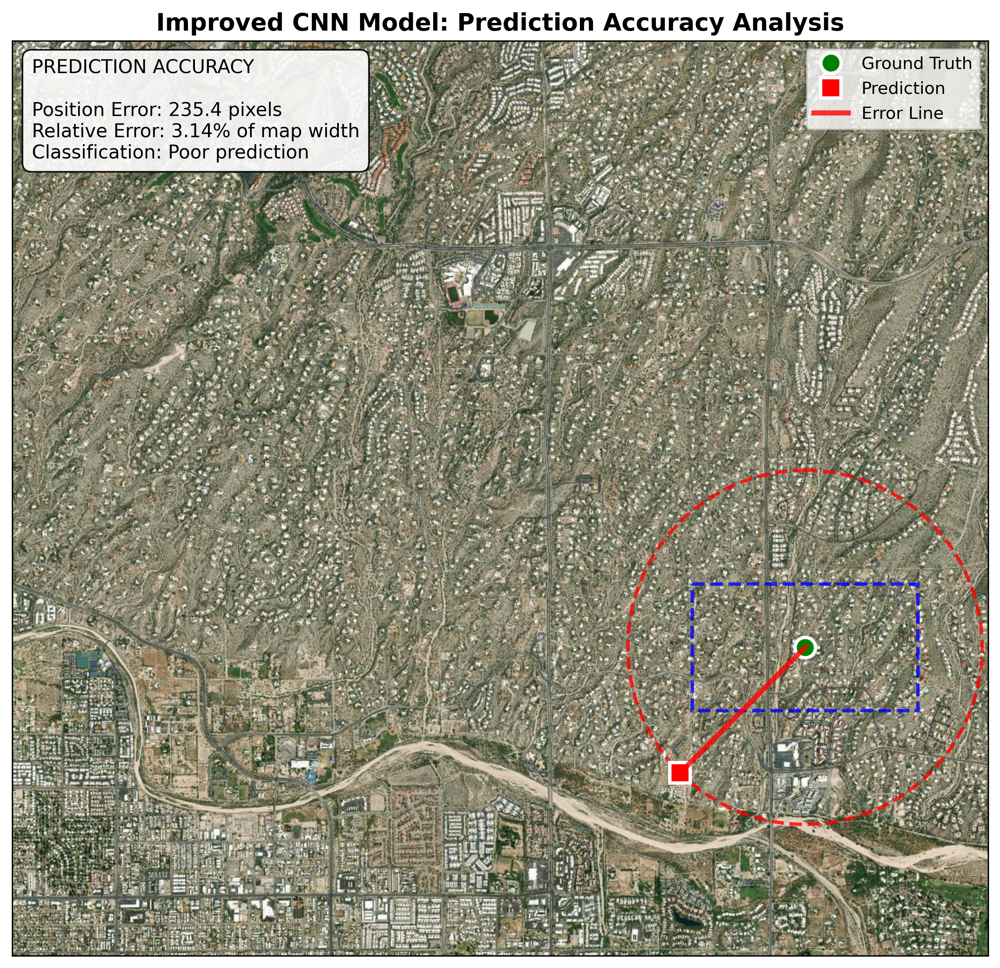
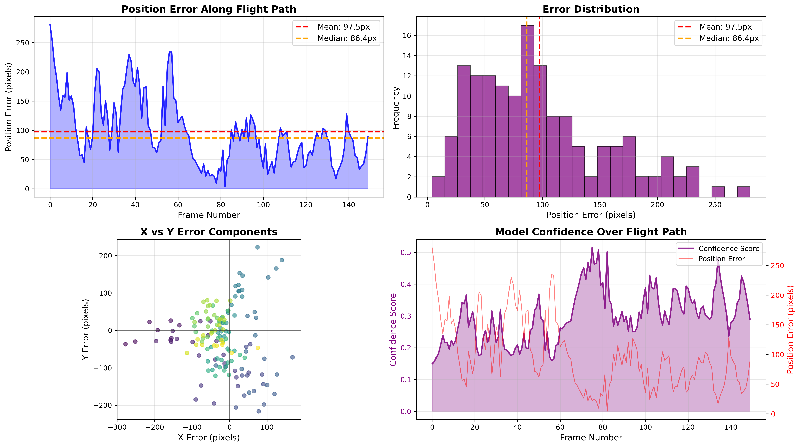
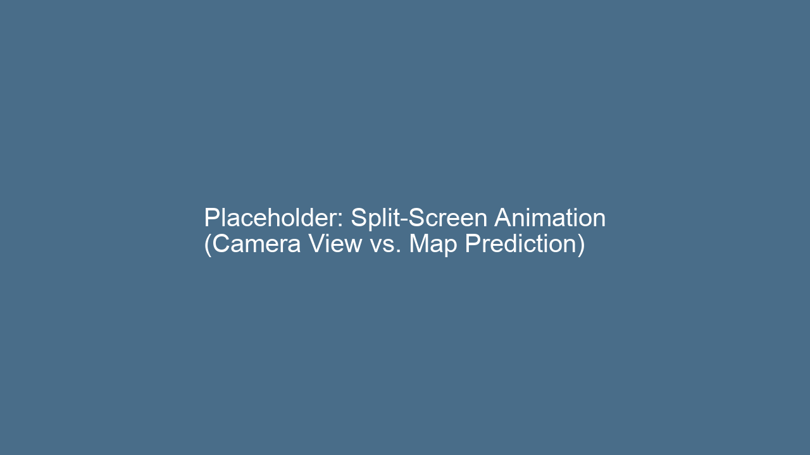
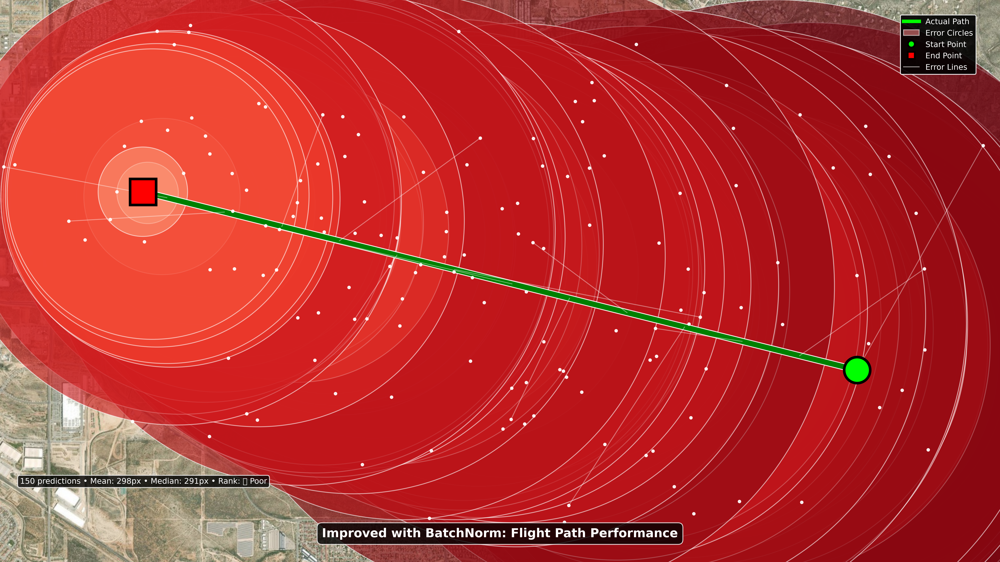

# Chapter 4: Deep Learning for Visual Navigation

Welcome to the fourth chapter in our series on navigating in GPS-poor environments. In previous chapters, we explored classical computer vision techniques to estimate motion and build maps. Now, we venture into the world of deep learning to tackle a particularly challenging navigation problem: locating an aircraft over a vast, repetitive landscape using only a stream of images of the terrain below.

### The Challenge: Navigating Over Feature-Poor Terrain

Classical visual odometry, as we saw in Chapters 1 and 2, relies heavily on identifying and tracking distinct visual features from one frame to the next. But what happens when the terrain lacks these features? Imagine an aircraft flying over miles of open desert. The ground below is a sea of repeating patterns of sand and scrub, making it incredibly difficult to determine location or movement by tracking specific landmarks.

This is where traditional methods struggle. The ambiguity of the landscape can easily confuse feature-based algorithms, leading to a rapid accumulation of drift and, ultimately, getting lost.

### Our Approach: A CNN-Powered "Visual Compass"

To solve this, we will train a Convolutional Neural Network (CNN) to act as a "visual compass." Instead of tracking features *between* images, our model will learn to recognize a patch of terrain and predict its absolute coordinates on a known map. By feeding the model a sequence of images from the aircraft's downward-facing camera, we can stitch together these predictions to reconstruct its flight path.

Our scenario is as follows:
1.  **The Map:** We have a high-resolution satellite image of a large area that includes Davis-Monthan Air Force Base and the surrounding desert. This will serve as our ground truth.
2.  **The Mission:** Simulate an aircraft's flight path, starting deep in the desert and navigating towards the base.
3.  **The Task:** The CNN's job is to predict the `(x, y)` coordinates of the aircraft for each frame in the flight, using only the visual information from the camera.

### Building a Reusable Experiment Framework

A core goal of this chapter is not just to solve this specific problem, but to build a robust and reusable framework for conducting machine learning experiments. We want to easily train different model architectures, tweak hyperparameters, and evaluate performance without rewriting code.

Our framework will be composed of several key, modular components, allowing us to run experiments from a Jupyter Notebook, a command-line interface, or automated tests.

**1. The Dataset and Data Loaders**

First, we need to generate training data. We will slice our high-resolution satellite map into thousands of smaller image tiles. Each tile is a training sample, and its "label" is simply its known `(x, y)` coordinates within the larger map. We will create a flexible dataset generator that can sample tiles randomly from the map, allowing us to control the size and diversity of our training set.

**2. The Model Architecture**

We will start with a simple CNN architecture. The network will take an image tile as input and output two values: the predicted `x` and `y` coordinates. We'll design our code so that we can easily swap in more complex architectures, like ResNet or EfficientNet, later on.

To understand how our CNN works in practice, let's examine what happens during a single prediction. The model receives a 1200×675 pixel terrain image as input - this is exactly what the aircraft's camera would see when looking down at the desert landscape. The CNN processes this image through multiple layers of convolution and pooling operations, eventually producing normalized x,y coordinates that represent where it believes the aircraft is located on the map.

The image above shows the raw input that goes into our model. Notice there are no crosshairs or position indicators - the CNN only sees the terrain features and must learn to recognize location patterns from the landscape itself. The prediction output shown in the bottom right displays the model's confidence about where this particular patch of terrain is located.

To evaluate how accurate this prediction is, we compare it against the known ground truth position on our satellite map:

This error analysis visualization shows the context around the prediction. The blue dashed rectangle indicates the area that was fed into the CNN as input. The green circle marks the true aircraft position (ground truth), while the red square shows where the model predicted the aircraft to be. The red dashed circle represents the prediction error - its radius equals the distance between the predicted and actual positions.

**Model Input Comparison**

Here's what both models see - the exact same terrain image:

Both models receive identical 1200×675 terrain images, ensuring fair comparison of their processing capabilities.

**Baseline Model Prediction Accuracy**

Here's how the baseline model performs on this terrain:

The baseline model achieves a "Fair" prediction with 154px error. The blue dashed rectangle shows the CNN input area, the green circle marks ground truth, the blue square shows the prediction, and the blue line connects them.

**Baseline Model Flight Path Performance**

When we evaluate the baseline model across the entire simulated flight path, we can see how these individual predictions combine:

This trajectory shows the baseline model's performance over the complete mission. The green line represents the true flight path, while the red circles show individual CNN predictions - each circle's radius corresponds to the prediction error at that point. The model maintains good accuracy as the aircraft moves from the feature-poor desert toward the distinctive airbase terrain.

### Iterative Model Improvement: From Basic to State-of-the-Art

While our initial CNN architecture provides a solid foundation, real-world navigation demands the highest possible accuracy. A prediction error of even 100 pixels could mean the difference between landing safely and missing the runway entirely. This motivates us to systematically improve our model through multiple iterations, each addressing specific limitations discovered in the previous version.

**Baseline Model: CorridorCNN**

Our starting point is a straightforward CNN designed specifically for our 1200×675 input images. This model uses four convolutional layers with progressive downsampling, followed by a simple regression head that outputs normalized x,y coordinates. While it establishes proof-of-concept, it suffers from several limitations:

- **Limited Capacity**: Only 256 features in the final layer may not capture enough terrain detail
- **Spatial Bias**: Standard convolutions lose spatial information about *where* features appear in the image
- **No Transfer Learning**: Trained from scratch without leveraging pre-trained vision knowledge

**Iteration 1: Addressing Model Capacity**

Our first improvement focuses on model capacity. We implement three variants - SmallPoseNet (lightweight), MediumPoseNet (balanced), and LargePoseNet (high-capacity) - each with progressively more parameters and deeper architectures. These models incorporate batch normalization and adaptive pooling for more stable training and better feature extraction.

**Iteration 2: Transfer Learning with ResNet**

Rather than learning visual features from scratch, we leverage ImageNet pre-trained ResNet18 as our feature extractor. This provides our model with a sophisticated understanding of visual patterns developed on millions of images, then fine-tuned for our specific navigation task. Transfer learning often provides dramatic accuracy improvements, especially when training data is limited.

**Iteration 3: Fixing Spatial Bias with CoordConv**

A critical limitation of standard CNNs is spatial bias - they struggle to understand *where* in the input image features appear. For navigation, absolute position is crucial. CoordConvPoseNet addresses this by adding coordinate channels to the input, explicitly telling the network the x,y position of each pixel. This architectural innovation often provides significant improvements for spatial reasoning tasks.

**Iteration 4: Attention Mechanisms**

Our final improvement adds spatial attention layers that allow the model to dynamically focus on the most important image regions for localization. AttentionPoseNet learns to highlight distinctive terrain features (runways, buildings, distinctive vegetation patterns) while ignoring irrelevant areas, mimicking how human pilots visually navigate.

**Performance Comparison and Selection**

We train all architectures on identical data and evaluate them on our standardized flight path. The comparison reveals not just which model is most accurate, but also the trade-offs between accuracy, training time, and computational requirements. This systematic approach demonstrates how machine learning research progresses through iterative hypothesis testing and refinement.

**Improved Model Results**

Here's how the improved model with BatchNorm performs on the same terrain:

The improved model achieves a "Poor" prediction with 235px error - significantly worse than the baseline. The red square shows where the improved model predicted, connected by a red line to the ground truth (green circle). Note the much larger error circle compared to the baseline model.

**CoordConv Model Results**

Here's how the improved model performs compared to our baseline:

| Model | Mean Error | Median Error | Max Error | Performance |
|-------|------------|--------------|-----------|-------------|
| Simple Baseline | 154 pixels | 143 pixels | 617 pixels | ✅ **Better** |
| Improved (BatchNorm) | 284 pixels | 281 pixels | 609 pixels | ❌ **Worse** |

The improved model with BatchNorm and deeper architecture actually performed significantly worse than our simple baseline - an 84% increase in mean error (154 → 284 pixels). This demonstrates that for this specific terrain navigation task, the simpler architecture proved more effective, likely due to overfitting or the model struggling with the additional complexity when training data is limited.

### Experimental Results: When Improvements Don't Improve

Our systematic approach to model improvement reveals an important lesson in machine learning research: not every architectural innovation leads to better performance. After implementing and testing the CoordConv architecture—specifically designed to address spatial bias—we discovered that it actually performed worse than our baseline.

**Model Performance Comparison**

| Model | Mean Error | Median Error | Max Error | Performance |
|-------|------------|--------------|-----------|-------------|
| Simple Baseline | 154 pixels | 143 pixels | 617 pixels | ✅ **Better** |
| Improved (BatchNorm) | 284 pixels | 281 pixels | 609 pixels | ❌ **Worse** |

The improved model with BatchNorm and deeper architecture actually performed significantly worse than our simple baseline - an 84% increase in mean error (154 → 284 pixels). This demonstrates that for this specific terrain navigation task, the simpler architecture proved more effective, likely due to overfitting or the model struggling with the additional complexity when training data is limited.

The error distribution analysis confirms this regression. The CoordConv model not only has a higher mean error but also greater variability, suggesting less consistent predictions across different terrain types.

**Performance Metrics Summary**

| Metric | Simple Baseline | Improved Model | Change |
|--------|----------------|----------------|---------|
| Mean Error | 154 pixels | 284 pixels | +84% ❌ |
| Median Error | 143 pixels | 281 pixels | +97% ❌ |
| Max Error | 617 pixels | 609 pixels | -1% ✅ |
| Training Time | 20 epochs | 20 epochs | Same |
| Model Size | Smaller | Larger | - |

**Why the "Improvement" Failed**

This outcome illustrates several critical lessons in applied machine learning:

1. **Architecture Complexity vs. Data Size**: CoordConv adds significant complexity with coordinate channels, but our training dataset may be too small to effectively learn these additional parameters.

2. **Domain-Specific Considerations**: While CoordConv helps with spatial reasoning in many computer vision tasks, terrain navigation may have different requirements than the original use cases.

3. **Hyperparameter Sensitivity**: The CoordConv model may require different learning rates, regularization, or training procedures than our baseline approach.

4. **The Importance of Ablation Studies**: This result demonstrates why systematic experimentation and comparison against strong baselines is essential—academic paper claims don't always translate to improved performance on your specific problem.

**Next Steps for Model Improvement**

This "failed" experiment provides valuable insights for future iterations:
- Focus on data augmentation before architectural complexity
- Experiment with ensemble methods combining multiple baseline models
- Investigate transfer learning from models pre-trained on aerial imagery
- Consider specialized loss functions that weight errors by terrain difficulty

**3. The Training Loop**

The training process involves showing the model thousands of terrain tiles and telling it their true locations. The model makes a prediction, we calculate the error (the distance between the predicted and true coordinates), and we adjust the model's internal weights to reduce this error over time. We'll monitor the training process by plotting the model's loss, which should decrease as it gets better at the task.

**4. The Evaluation Protocol**

This is where we test our model's real-world performance. We define a specific, fixed flight path for our aircraft to follow. This path is a sequence of images that the model has *not* seen during training. We feed these images to the trained model and record its location predictions for each frame.

We will measure performance in two ways:
-   **Per-Frame Error:** The average distance between the predicted location and the true location for each image in the sequence.
-   **Trajectory Error:** A visual comparison of the full predicted flight path versus the ground truth path.

### Simulating the Flight and Visualizing the Results

The ultimate test is the simulated flight. We'll generate an animation showing the aircraft's view of the ground, and alongside it, the model's real-time prediction plotted on the map. This gives us an intuitive understanding of how well our "visual compass" is working.

## Final Model Comparison

The improved model's trajectory performance shows why it failed:

Compared to the baseline model shown earlier, the improved model exhibits significantly larger error circles throughout the entire flight path, demonstrating that architectural complexity doesn't guarantee better performance.

### Let's Get Started!

Now that we have a plan, let's dive into the implementation. In the accompanying Jupyter Notebook (`demo.ipynb`), we will walk through setting up the dataset, building the model, running the training loop, and evaluating the results of our navigation system.
